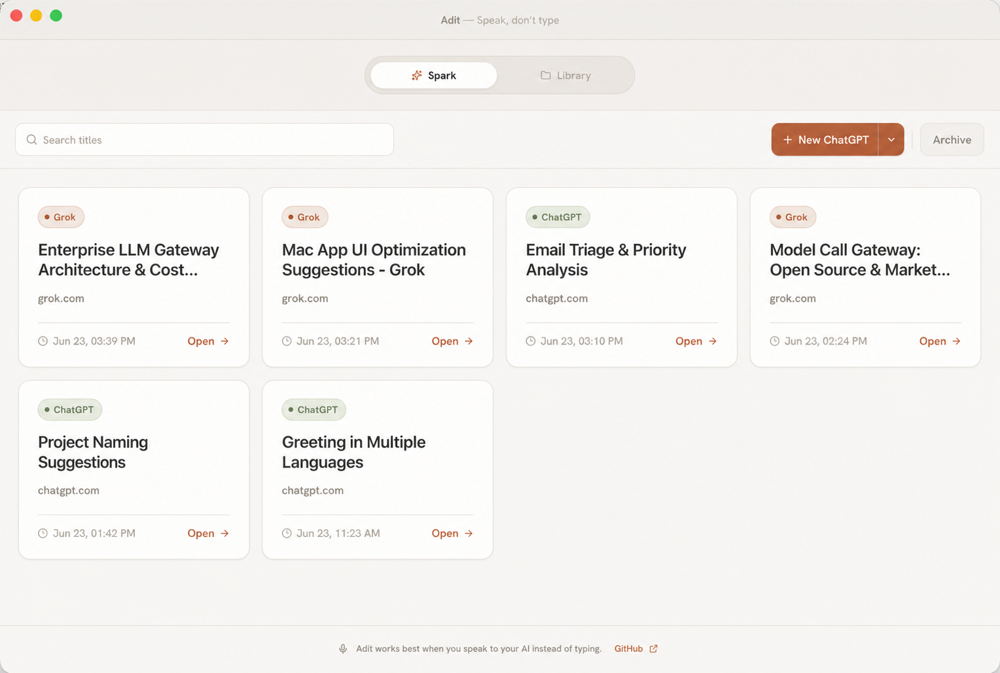

# Adit

A quiet macOS app for **AI-native notes**.

## Speak, don't type

In the AI-native era, your best work does not start at a keyboard. It starts in conversation — with the strongest LLM you have access to. You talk. The model listens, thinks, searches, drafts, generates, and produces. That is the real interface now.

Adit is built for that habit. Open a session, **speak to your AI**, and let the model do the heavy lifting. Typing is a fallback. Talking is the default.

## What Adit is

Adit is not another chat app. It is not a folder of old conversations.

It is a place to **work with AI and keep what matters**.

- **Spark** — where you start or return to a live session with ChatGPT, Grok, or another provider. It is the doorway into the work, not the finished note.
- **Library** — what you chose to keep: a summary, a document, an image, a piece of code, anything worth saving. Your notes live here, on your Mac. Not buried in a provider's history.

The conversation is where things get made. The Library is what you own afterward.

## How you use it

1. Open Adit.
2. Pick up an existing Spark or start a new one.
3. **Talk to your AI** — say what you want, refine as you go.
4. When something is worth keeping, save it to Library.
5. Come back later and read your notes without reopening the original chat.

You do not need to re-find old results inside ChatGPT or Grok. You keep the good parts yourself.

## What Adit will not become

- A transcript hoarder
- A tool that reads your chats without asking
- A replacement for the providers themselves
- A bloated "knowledge base" before the basics work

Adit only saves what **you** choose to save.

## What you can use today

- Resume ChatGPT and Grok sessions from a local Spark list
- Search and archive
- A calm macOS home for your AI work
- Library is coming — the tab is there, saving is next

## What's next

- Save the best results from a session into Library
- Browse everything you have kept, in one place
- Filter by provider, type, and time

## License

MIT
